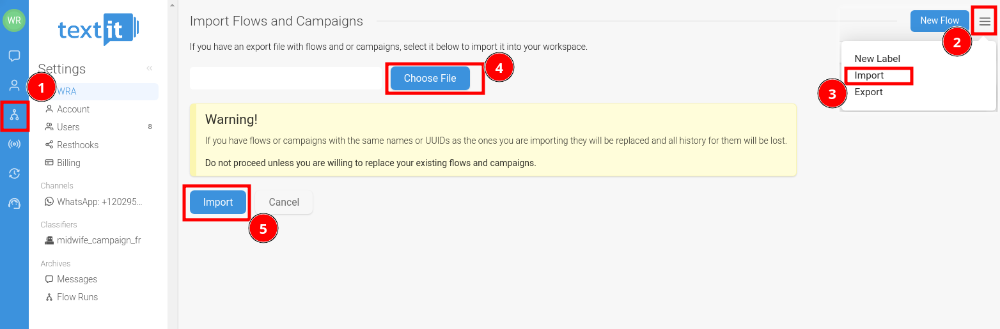
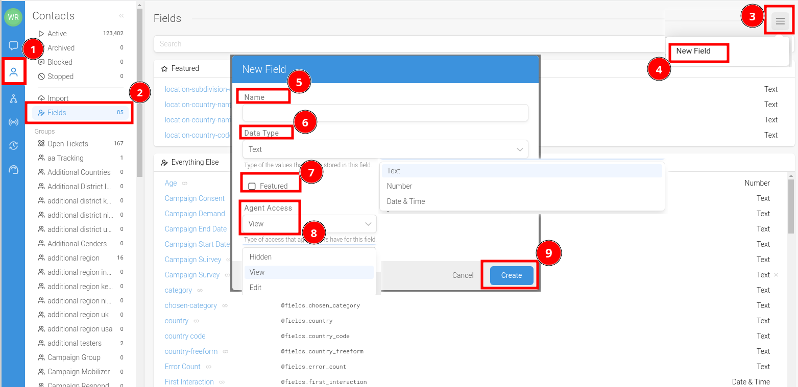
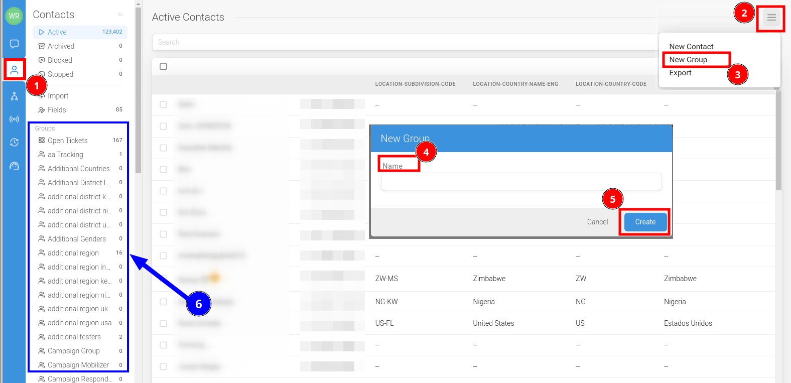
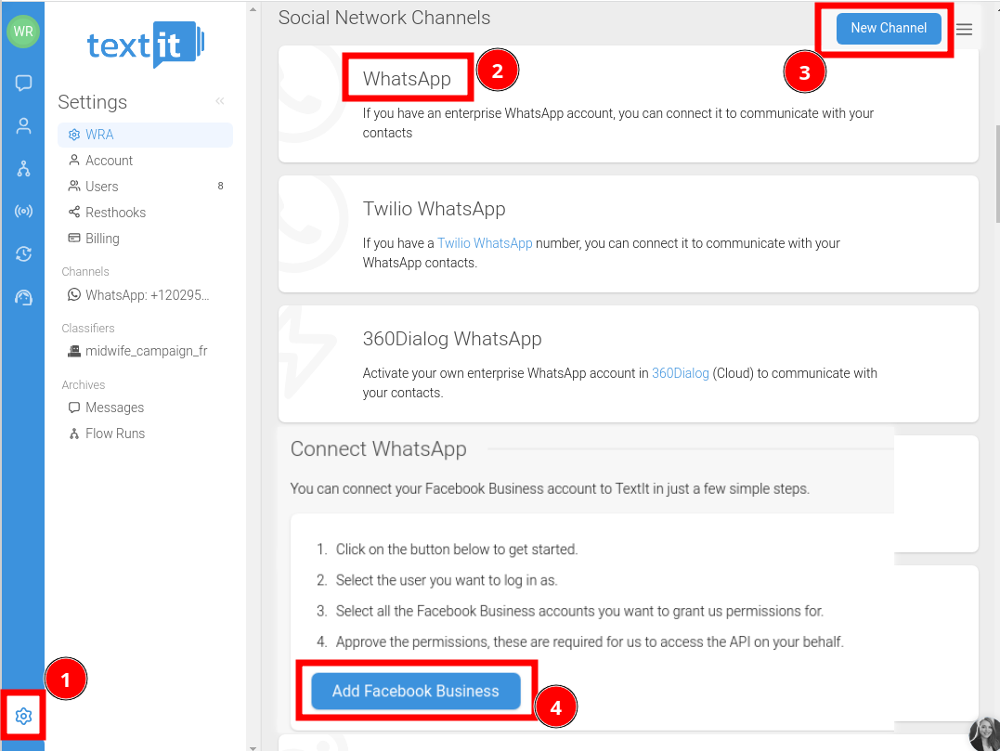
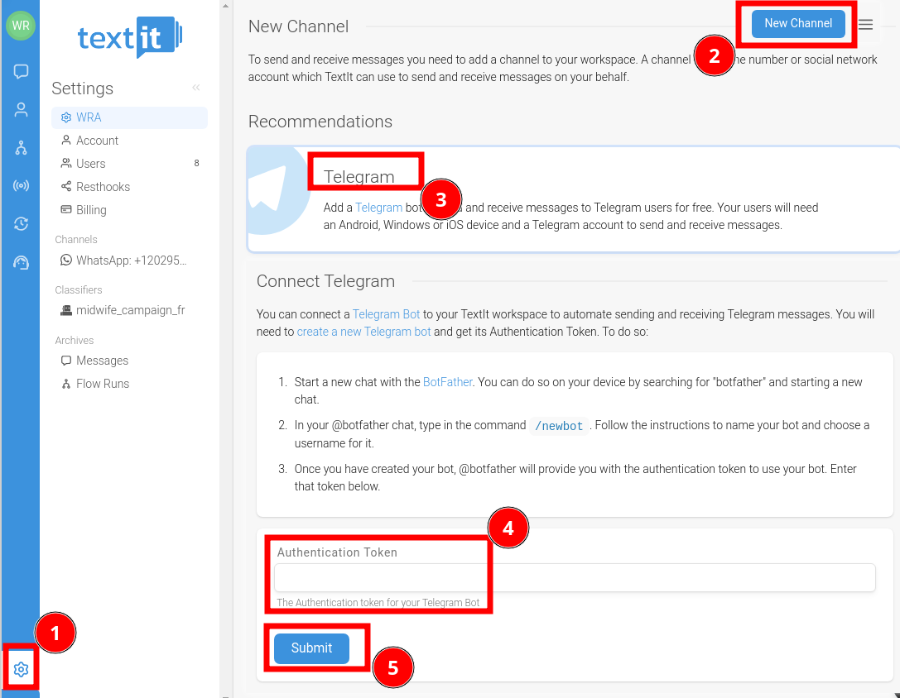
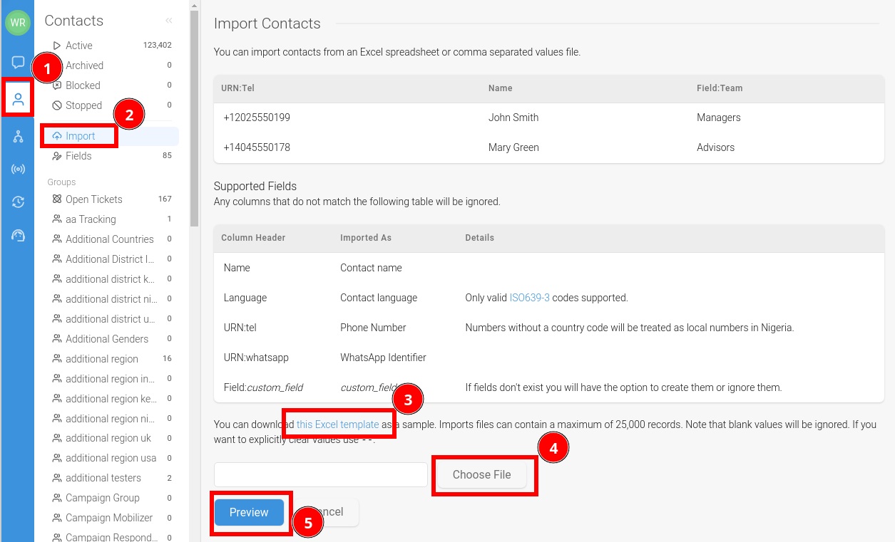

# WRA Global Social Impact Chatbot Project

## Chatbot Configuration Manual in Textit

## Introduction

This guide provides step-by-step instructions for setting up a chatbot in Textit, utilizing provided flow files from WRA project. You can either use Textit directly or install RapidPro, the open-source foundation of Textit.

## Configuration Steps

### 1. Email Setup for Your Project

* Have a corporate email or create a free email account, like Gmail.

### 2. Create a Textit Account

* Sign up at [textit.com](https://textit.com).

### 3. Alternative: Install RapidPro

* Optionally, install your own instance of RapidPro.
* Installation guide: [RapidPro Hosting Documentation](https://rapidpro.github.io/rapidpro/docs/hosting/).

### 4. Download Flow Files

* Download flow files from the provided repository into the `Flows` folder.

### 5. Import Flow Files into Textit

* Go to the import section in Textit and upload the downloaded flow files.

See the full list of flows in the project: [Flows List](Flows-List.md)

### 6. Configure 'Globals' Variables

* Set up global variables as required for your project.

See the full list of variables in the project: [Variables List](Variables-List.md)

### 7. Set Up 'Fields' Variables

* Customize the 'fields' variables according to your project's needs.
  

See the full list of variables in the project: [Variables List](Variables-List.md)

### 8. Adjust 'Groups' for user contacts

* Configure the 'groups' variables to suit your specific requirements.

### 9. Use 'Templates' Flows

* Identify flows marked as 'Templates' for copying and use.

### 10. Configure 'Triggers'

* Set triggers appropriate for your project's context and language.

### 11. Language Configuration

* Add a new language in Textit
  

* To edit languages texts using '.po' files for tailored language support. A `.po` file type, which is used for language translation, can be modified using various desktop applications. Additionally, it's possible to edit these files online through platforms like [Localise POEditor](https://localise.biz/free/poeditor). This provides a convenient and accessible option for users who prefer to work directly in a web-based environment.

### 12. Set Up Communication Channels

* WhatsApp is recommended, but other options like Telegram, Facebook Messenger, or RocketChat Web can be used.

  

Telegram

  

### 13. Testing with the Conversation Simulator

* Use Textit’s conversation simulator to test and refine your chatbot.

  

### 14. Import User List (Optional)

* You may import a pre-existing user list if available.

### 15. Monitoring Reports and Operations

* Regularly check reports and operational aspects of your chatbot for optimal performance.

Download interactions

## Useful Links

This section provides a collection of valuable resources and links for those interested in Textit, RapidPro, and related technologies. Whether you're looking for insights, tools, or community stories, these links offer a wealth of information.

### Textit and RapidPro Resources

*   **Textit Blog**: Discover the latest updates, tips, and stories on Textit's official blog.

    *   [Textit Blog](https://blog.textit.com/)
    *   [Nyaruka Blog](https://blog.nyaruka.com/)
    *   [RapidPro Community Stories](https://community.rapidpro.io/stories/)

*   **RapidPro Flow Repository**: Access a variety of flow templates and examples in RapidPro's community-driven repository.

    *   [RapidPro Flow Repository](https://community.rapidpro.io/rapidpro-flow-repository/)

*   **GitHub Repositories**: Explore the code and contribute to the ongoing development of these platforms.

    *   [Textit on GitHub](https://github.com/nyaruka/rapidpro)
    *   [RapidPro on GitHub](https://github.com/rapidpro/rapidpro)
    *   [White Ribbon Alliance GitHub](https://github.com/whiteribbonalliance)

### NLP Classifiers

Leverage these tools for natural language processing and understanding in your chatbot projects.
*  **LUIS**
*  **WIT**
[See NLU_alternatives](./NLU/NLU_alternatives.md)

### Alternatives for WhatsApp Channels

Explore these platforms as alternatives or additional options for integrating WhatsApp and other messaging channels into your chatbot.

*   **Twilio**: A cloud communications platform offering a variety of messaging services.
*   **360Dialog**: Specializes in WhatsApp Business API solutions.
*   **Telegram**: A cloud-based mobile and desktop messaging app with a focus on security and speed.
*   **FB Messenger**: Facebook's instant messaging platform.
*   **Web (RocketChat)**: An open-source team communication platform that can be used for web messaging.

## Conclusion

Following these steps will enable you to set up and customize a chatbot in Textit tailored to your project's needs. It is advisable to refer to specific documentation for Textit and RapidPro for more technical details and comprehensive guides.
