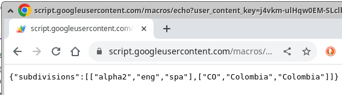
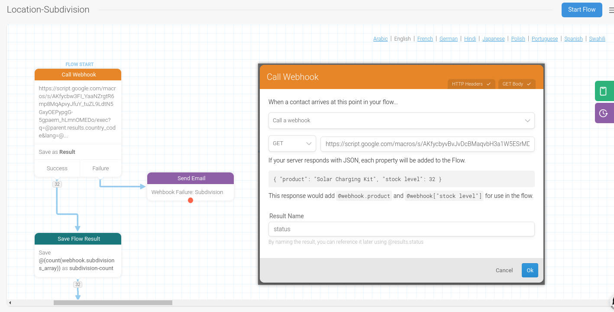

# How to Use a Custom API for Global Location Information in Chatbots

## Introduction

This document guides you on integrating a custom API to provide location information for all world countries in your chatbot. This feature is essential for localizing language preferences based on the user's phone or Whatsapp number prefix or the flag emoji of their country.

This document serves as a comprehensive guide to integrating a custom API for providing location information for all world countries in chatbots. While there is an existing API available that is currently unmaintained but still active. For those interested in tailoring the system to their specific needs, we provide a copy of the spreadsheet in Excel `.xlsx` format, allowing you to create your own customized version of the system. This flexibility encourages chatbot developers to expand upon the existing framework by adding more languages or enhancing the emoji experience to better align with their specific location, language, and cultural requirements. 

### Using a simple spreadsheet as data source

The data that powers the API described in this guide is meticulously organized in a spreadsheet, enabling the creation of a Google Script to transform this data into a functional API. The Excel file containing this valuable data is named `WWW_Country_States_Sub-Divisions.xlsx`. By leveraging this resource, you can significantly enhance the global reach and contextual relevance of your chatbot or digital service.


### Alternative 1: API Call Structure to Request Country Code Name based on International Prefix Phone Number

This section outlines the API's structure to fetch country code names using international phone number prefixes. It's a critical feature for localizing chatbot interactions based on the user's phone number.

The API call should include parameters for location information. The URL format is:

`https://script.google.com/macros/s/[SCRIPT_ID]/exec?q=[QUERY]&lang=[LANGUAGE]`

* `q`: Represents the query, such as a phone number prefix or flag emoji.
* `lang`: Specifies the desired language for the response.

##### API Call Example
`https://script.google.com/macros/s/AKfycbyvBvJvDcBMaqvbH3a1W5ESrMD_me98LDk6kUP-NYGv2Oknl7ooHNMXIyo333sMK2kpoQ/exec?q=91&lang=eng`




### Alternative 2: API Call Structure for Language and Location Information Based on Country Flag Emoji

This section explains the structure of the GET request for the custom API, designed to retrieve location and language information based on country flag emojis and specified language preferences. This capability allows for enhanced personalization in chatbot interactions, catering to the user's cultural and linguistic context.

The API GET request is structured as follows:

`https://script.google.com/macros/s/[SCRIPT_ID]/exec?e=[EMOJI]&lang=[LANGUAGE]`

*  `e`: Represents the emoji corresponding to a country's flag.
*  `lang`: Specifies the language code for the desired response.

##### API Call Example
`https://script.google.com/macros/s/AKfycbzn6ZLNiltrr\_OzlHobwN6wKN3bGtG\_HdYRUQ1cktYhml4I7jm\_Z7s7geKVEdiZNbV1/exec?e=%F0%9F%87%A8%F0%9F%87%B4\&lang=spa
`

#### Examples 
##### Based on phone prefix 'q' and language 'lang' parameters
1. **Asia (India) - Hindi Language**:\
`https://script.google.com/macros/s/AKfycbyvBvJvDcBMaqvbH3a1W5ESrMD_me98LDk6kUP-NYGv2Oknl7ooHNMXIyo333sMK2kpoQ/exec?q=91&lang=hin`
2. **Africa (Kenya) - Swahili Language**:\   `https://script.google.com/macros/s/AKfycbyvBvJvDcBMaqvbH3a1W5ESrMD_me98LDk6kUP-NYGv2Oknl7ooHNMXIyo333sMK2kpoQ/exec?q=254&lang=swa`
3. **Europe (Germany) - German Language**:\
`https://script.google.com/macros/s/AKfycbyvBvJvDcBMaqvbH3a1W5ESrMD_me98LDk6kUP-NYGv2Oknl7ooHNMXIyo333sMK2kpoQ/exec?q=49&lang=deu`
4. **North America (Canada) - French Language**:\   `https://script.google.com/macros/s/AKfycbyvBvJvDcBMaqvbH3a1W5ESrMD_me98LDk6kUP-NYGv2Oknl7ooHNMXIyo333sMK2kpoQ/exec?q=1&lang=fra`
5. **South America (Brazil) - Portuguese Language**:\   `https://script.google.com/macros/s/AKfycbyvBvJvDcBMaqvbH3a1W5ESrMD_me98LDk6kUP-NYGv2Oknl7ooHNMXIyo333sMK2kpoQ/exec?q=55&lang=por`
6. **Oceania (Australia) - English Language**:\  `https://script.google.com/macros/s/AKfycbyvBvJvDcBMaqvbH3a1W5ESrMD_me98LDk6kUP-NYGv2Oknl7ooHNMXIyo333sMK2kpoQ/exec?q=61&lang=eng`

##### Based on emoji 'e' and language 'lang' parameters
1. **Asia (Japan) - Japanese Language**:\  `https://script.google.com/macros/s/AKfycbzn6ZLNiltrr_OzlHobwN6wKN3bGtG_HdYRUQ1cktYhml4I7jm_Z7s7geKVEdiZNbV1/exec?e=%F0%9F%87%AF%F0%9F%87%B5&lang=jpn`
2. **Africa (South Africa) - Afrikaans Language**:\ `https://script.google.com/macros/s/AKfycbzn6ZLNiltrr_OzlHobwN6wKN3bGtG_HdYRUQ1cktYhml4I7jm_Z7s7geKVEdiZNbV1/exec?e=%F0%9F%87%BF%F0%9F%87%A6&lang=afr`
3. **Europe (Spain) - Spanish Language**:\    `https://script.google.com/macros/s/AKfycbzn6ZLNiltrr_OzlHobwN6wKN3bGtG_HdYRUQ1cktYhml4I7jm_Z7s7geKVEdiZNbV1/exec?e=%F0%9F%87%AA%F0%9F%87%B8&lang=spa`
4. **North America (Canada) - French Language**:\ `https://script.google.com/macros/s/AKfycbzn6ZLNiltrr_OzlHobwN6wKN3bGtG_HdYRUQ1cktYhml4I7jm_Z7s7geKVEdiZNbV1/exec?e=%F0%9F%87%A8%F0%9F%87%B4&lang=fra`
5. **South America (Brazil) - Portuguese Language**:\ `https://script.google.com/macros/s/AKfycbzn6ZLNiltrr_OzlHobwN6wKN3bGtG_HdYRUQ1cktYhml4I7jm_Z7s7geKVEdiZNbV1/exec?e=%F0%9F%87%A7%F0%9F%87%B7&lang=por`
6. **Oceania (Australia) - English Language**:\ `https://script.google.com/macros/s/AKfycbzn6ZLNiltrr_OzlHobwN6wKN3bGtG_HdYRUQ1cktYhml4I7jm_Z7s7geKVEdiZNbV1/exec?e=%F0%9F%87%A6%F0%9F%87%BA&lang=eng`

By using these API calls, a chatbot can dynamically adjust its language settings based on the user's location, as inferred from the country flag emoji and the desired language. This feature significantly enhances the chatbot's ability to engage with users in a more personalized and culturally relevant manner.

### Integration with Textit Flows for Automatic Language Selection

1  **Textit Platform Compatibility**: Ensure that your API is compatible with Textit flows. This will enable seamless integration for language selection.
2. **Automatic Language Identification**: Utilize Textit's capabilities to detect the user's language preference automatically. This can be based on the country's flag emoji or the phone or WhatsApp number prefix.
3. **Flow Customization**: Set up flows in Textit to interpret the API response and select the appropriate language for the chatbot's interactions.
4. **Real-time Updates**: Ensure that the Textit flows can handle real-time updates from the API, allowing dynamic language switching based on user input.




## Create your own location API service 
This guide also explores the possibility of developing and maintaining your own API service, offering greater control and customization. Such integration is particularly vital for localizing language preferences based on user-specific details, such as their phone or WhatsApp number prefix or the flag emoji representing their country. This capability not only enhances the user experience but also ensures that the chatbot communication is relevant and accessible to users worldwide.


## Step 1: Understanding the API

The API leverages ISO 3166 country codes for identifying countries and their subdivisions, offering translations in eleven languages, and is linked to a customizable Google Spreadsheet.

## Step 2: Setting Up and Linking the Google Spreadsheet

Create a Google Spreadsheet with relevant columns, you can import the `xlsx` example file provided, and implement a Google Script to connect this spreadsheet with the API.

## Step 3: Implementing the Google Script

Adapt or develop a Google Script that fetches data from the spreadsheet and exposes an API endpoint. The code is here. `getSubDivisions.gs` 

```javascript
function doGet(e) {
  var spreadsheetId = '1gLT1JrKWtLaFRUPXkd7NTq4udVXCp3xtJAPzjFQ4L2M';
  var ss = SpreadsheetApp.openById(spreadsheetId);
  var queryStr = e.queryString;


    function getCountryString(){
      if(queryStr){
        //assumes that there is one input value
        var arr = queryStr.split("=");
        var country = decodeURIComponent(arr[1]);
        return country;
      }
      return "null";
    }

    function getSubDivisions(countrycode) {
      var spreadsheetId = '1gLT1JrKWtLaFRUPXkd7NTq4udVXCp3xtJAPzjFQ4L2M';
      var targetSheet = 'countrystates';
      var q1 = 'select B where E="';
      var query = q1.concat(countrycode, '"');
      Logger.log(query)

      var ss = SpreadsheetApp.openById(spreadsheetId);
      var sheetId = ss.getSheetByName(targetSheet).getSheetId();
      var url = "https://docs.google.com/spreadsheets/d/" + spreadsheetId + "/gviz/tq?gid=" + sheetId + "&tqx=out:csv&tq=" + encodeURIComponent(query);
      var res = UrlFetchApp.fetch(url, {headers: {Authorization: "Bearer " + ScriptApp.getOAuthToken()}});
      var values = Utilities.parseCsv(res.getContentText());
      Logger.log(values)
      return ContentService.createTextOutput(JSON.stringify({'subdivisions': values})).setMimeType(ContentService.MimeType.JSON);
    }

    var countrycode = getCountryString(queryStr);
    Logger.log(countrycode)
    return getSubDivisions(countrycode);

}
```


## Step 4: Chatbot Integration with Textit
Utilize Textit flows to incorporate the API's logic, enabling the chatbot to make GET requests based on user input like phone number prefixes or flag emojis. Textit's platform allows for straightforward integration, automatic language identification, and dynamic updates from the API for real-time language switching.

## Step 5: Customizing Language and Location Preferences
The API response is used to set the chatbot’s language and customize responses based on the user's location and preferred language.
This integration facilitates a more personalized and localized user interaction in global campaigns, utilizing the powerful language customization and location-specific features.

## Note

Maintain the accuracy and relevance of your Google Spreadsheet and Script to ensure the chatbot's effective localization and language translation.
