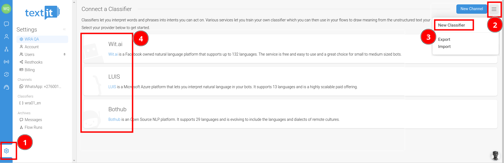
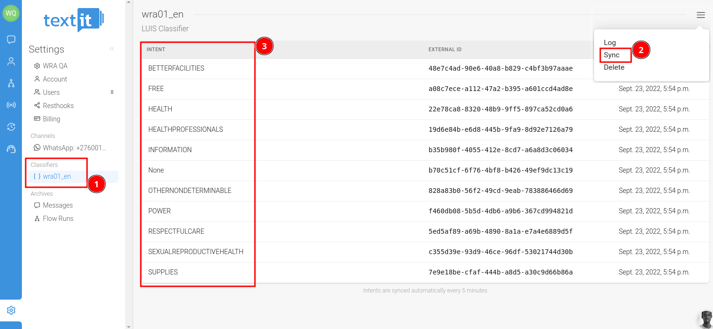

# Integrating and Synchronizing NLP Servers with Textit

This documentation guides you through the process of integrating and synchronizing NLP servers with Textit. We will focus on two compatible NLP services: WIT from Meta (https://wit.ai/) and LUIS from Microsoft (https://www.luis.ai/).

## Prerequisites
* An active account with Textit.
* Access to WIT from Meta or LUIS from Microsoft.
* Basic understanding of NLP training concepts and API integration.

## Option 1: Integrating WIT from Meta with Textit

### Step 1: Creating a WIT Application
* Visit https://wit.ai/ and sign in.
* Follow the instructions to create a new application.
* Note down the Server Access Token provided.
### Step 2: Setting up the Integration in Textit
* Log into your Textit account.
* Navigate to the classifiers section.
* Select 'Add Classifier' and choose 'WIT'.
* Enter the Server Access Token from WIT.
### Step 3: Testing the Integration
* Create a flow in Textit that uses the WIT integration.
* Test the flow with sample inputs to ensure proper classification.

## Option 2: Integrating LUIS from Microsoft with Textit

### Step 1: Creating a LUIS Application
* Go to https://www.luis.ai/ and sign in.
* Create a new LUIS application.
* Note down the Application ID and Endpoint Key.
### Step 2: Setting up the Integration in Textit
* In Textit, navigate to the classifiers section.
* Choose 'Add Classifier' and select 'LUIS'.
* Enter the Application ID and Endpoint Key from LUIS.
* Configure additional settings as required.
### Step 3: Testing the Integration
* Use a Textit flow to test the LUIS integration.
* Ensure the text classification works as expected with various inputs.


## Syncing the NLU Server with Textit

### Data Mapping and Management
* Map the NLP classification results to Textit fields.
* Ensure proper data handling and privacy measures.
 



# Example
In the following example, you'll see how Textit receives and handles a response from LUIS, Microsoft's Language Understanding service. Imagine you have trained LUIS to recognize specific user requests. When a user sends a message to your Textit flow, it's forwarded to LUIS for analysis. LUIS processes the message, figures out what the user wants, and sends this information back to Textit. Textit then uses this information to respond appropriately to the user. Let's look at an example.

```bash
    GET /luis/api/v2.0/apps/7154b733-d953-49ea-b5a9-4fda78fd0a2f/versions/0.1/intents HTTP/1.1
    Host: wwwchatbot.cognitiveservices.azure.com
    User-Agent: python-requests/2.28.2
    Accept-Encoding: gzip, deflate
    Accept: */*
    Connection: keep-alive
    Ocp-Apim-Subscription-Key: fefaa9b17a474c26b9cd1c50d73baef0

<!---->

    HTTP/1.1 200 OK
    Cache-Control: no-store, proxy-revalidate, no-cache, max-age=0, private
    Content-Length: 1254
    Content-Type: application/json; charset=utf-8
    pragma: no-cache
    request-id: 54aec6c5-f077-48c8-902e-64f6b39ed09d
    apim-request-id: 54aec6c5-f077-48c8-902e-64f6b39ed09d
    x-envoy-upstream-service-time: 49
    warn-code: 299
    warn-agent: -
    warn-text: The LUIS service has announced retirement. All LUIS APIs will be removed on October 1, 2025. You can migrate to its replacement, conversational language understanding. Learn more at https://aka.ms/clu-migration
    Strict-Transport-Security: max-age=31536000; includeSubDomains; preload
    x-content-type-options: nosniff
    x-ms-region: West US
    Date: Tue, 28 Nov 2023 10:56:19 GMT

    [{"id":"48e7c4ad-90e6-40a8-b829-c4bf3b97aaae","name":"BETTERFACILITIES","typeId":0,"readableType":"Intent Classifier"},{"id":"a08c7ece-a112-47a2-b395-a601ccd4ad8e","name":"FREE","typeId":0,"readableType":"Intent Classifier"},{"id":"22e78ca8-8320-48b9-9ff5-897ca52cd0a6","name":"HEALTH","typeId":0,"readableType":"Intent Classifier"},{"id":"19d6e84b-e6d8-445b-9fa9-8d92e7126a79","name":"HEALTHPROFESSIONALS","typeId":0,"readableType":"Intent Classifier"},{"id":"b35b980f-4055-412e-8cd7-a6a8d3c06034","name":"INFORMATION","typeId":0,"readableType":"Intent Classifier"},{"id":"b70c51cf-6f76-4bf8-b426-49ef9dc13c19","name":"None","typeId":0,"readableType":"Intent Classifier"},{"id":"828a83b0-56f2-49cd-9eab-783886466d69","name":"OTHERNONDETERMINABLE","typeId":0,"readableType":"Intent Classifier"},{"id":"f460db08-5b5d-4db6-a9b6-367cd994821d","name":"POWER","typeId":0,"readableType":"Intent Classifier"},{"id":"5ed5af89-a69b-4890-8a1a-e7a4e6889d5f","name":"RESPECTFULCARE","typeId":0,"readableType":"Intent Classifier"},{"id":"c355d39e-93d9-46ce-96df-53021744d30b","name":"SEXUALREPRODUCTIVEHEALTH","typeId":0,"readableType":"Intent Classifier"},{"id":"7e9e18be-cfaf-444b-a8d5-a30c9d66b86a","name":"SUPPLIES","typeId":0,"readableType":"Intent Classifier"}]

```

## Conclusion
Integrating and synchronizing an NLP server with Textit enhances the capabilities of your chatbot and text analysis tools. With WIT from Meta and LUIS from Microsoft, you can classify texts effectively and efficiently. Remember to regularly monitor and update your configurations to maintain optimal performance.

## Support and Further Resources

* For more help, visit the official documentation of WIT (https://wit.ai/docs) and LUIS (https://docs.microsoft.com/en-us/azure/cognitive-services/luis/).
* Contact Textit [support](support@textit.com) at support@textit.com for any integration-specific queries.
