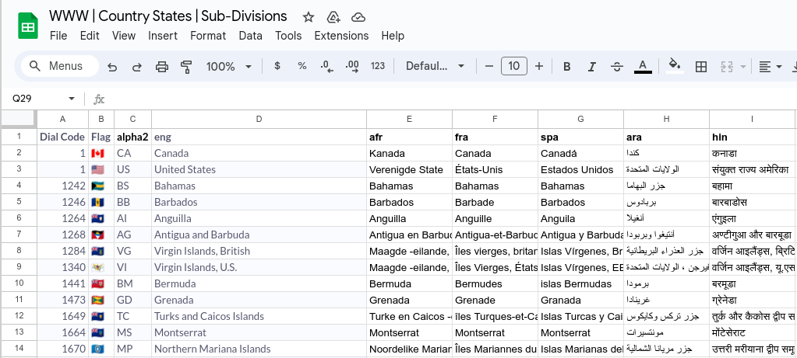

# WRA-Chatbot-Open-Source-Kit
White Ribbon Alliance chatbot project logic and flows now available open-source for sharing and collaboration.

## WRA Global Social Impact Chatbot Project

## Introduction
Welcome to the repository of the WRA Global Social Impact Chatbot, an innovative project that combines the power of the [Textit Platform](https://textit.com/), a spinoff of the open-source platform from UNICEF, [RapidPro](https://github.com/rapidpro/), with WhatsApp Channel API and other open-source resources to create a transformative tool for community engagement and support. This project is inspired by the collaborative framework of the WRA project and aligns with the open-source movement showcased in [RapidPro's Flow Repository](https://community.rapidpro.io/rapidpro-flow-repository/) and the impactful narratives shared in [RapidPro's Stories](https://community.rapidpro.io/stories/). Our aim is to leverage technology for social good on a global scale.

### Project Features:
- **Open Source Flows**: We embrace the open-source community's spirit, offering our chatbot's flows for use and customization. This openness fosters a collaborative environment where innovations can thrive.
- **Advanced Logic**: Our chatbot employs sophisticated logic to manage complex conversation pathways, ensuring users have a smooth and intuitive interaction experience.
- **Multilingual Capabilities**: Recognizing the diversity of our global community, the chatbot supports multiple languages, ensuring inclusivity and broader accessibility.
- **Geographic Specificity**: To provide context-aware responses, the chatbot includes detailed geographic data, including country codes, administrative divisions, and phone codes.
- **Socially Relevant Content**: Drawing from the [What Women Want campaign](https://whiteribbonalliance.org/resources/what-women-want-chatbot-brochure/) by the White Ribbon Alliance, the chatbot is loaded with content that addresses vital community issues, focusing on health, empowerment, and support.

## Sharing the Knowledge
Aligned with the goals and values of the [White Ribbon Alliance](https://whiteribbonalliance.org/), this project is not just about technology; it's about harnessing that technology for the greater good. Our mission is to create a tool that can reach across borders and barriers, bringing support and information to those who need it most.

## Clone the WRA Chatbot Project
Here are the steps to follow to replicate the open-source chatbot on your own context. [Clone-WRA-Chatbot](Clone-WRA-Chatbot.md)

## Community Involvement
We believe in the power of community. This project thrives on collaboration and contributions from developers, content creators, translators, and social activists. Whether you're contributing code, improving translations, or sharing insights, your input is invaluable.

### How You Can Help:

- **Contribute to the Code**: Help us enhance the functionality and efficiency of the chatbot.
- **Localize Content**: Assist in translating and localizing content, making the chatbot accessible to non-English speakers.
- **Share Expertise**: Offer your knowledge in areas like UI/UX design, conversation design, or social advocacy to improve the chatbot's impact.
- **Spread the Word**: Help us reach more people who can benefit from or contribute to this project.

## Join Us

Your participation can make a significant difference. Together, we can build a chatbot that doesn’t just connect people but empowers and uplifts communities worldwide.


# WRA Global Social Impact Chatbot Project


## Chatbot Configuration in Textit

This guide provides step-by-step instructions for setting up a chatbot in Textit, utilizing provided flow files from WRA project. You can either use Textit directly or install RapidPro, the open-source foundation of Textit.

## General Chabtot Architecture


This diagram illustrates the interaction flow of the WRA Chatbot solution. It begins with the users that interact with Whatsapp, which facilitates the sending and receiving of messages, and then the Whatsapp API connects to a platform named Textit. Textit manages these messages through predefined flows and logic, using menus and also it integrates a natural language processing tool (either WIT or LUIS) to interpret some input user responses. Additionally, the chatbot utilizes Google Script for supplementary tasks to identify country codes, languages, and some translations in a spreadsheet. Ultimately, it compiles visual reports and dashboards, utilizing data from TextIt combined with external APIs. You can adapt this architecture diagram to your own requirements using generic diagram software and the provided `Mermaid code` as shown below:


```
graph LR
 	Users(Chatbot Users) --> WA(WhatsApp API)
    WA(WhatsApp API) -->|Messaging| TI(TextIt Platform)
    TI -->|Natural Language Processing| NLM("Natural Language Model")
    TI -->|Data Visualization| DR[Dashboards and Reports]
    GS(Google Script) --> CCS[Country Codes Spreadsheet]
    TI --> GS
```


## Dashboards showing the campaign results


The project also implements a dashboard for reports, to see detailed results of campaigns as an extension of the analytic capabilities of the system. These reports show  how users interacted. They also tell us about the types of people who interacted with the chatbot and how they response about the survey questions. This information helps the team understand the campaigns. The dashboards also let the team compare different campaigns to see which ones are more successful with the audience.

You can take on the role of a developer and create your own reports using data from the [TextIt API](https://textit.com/api/v2/explorer/). This allows you to tailor the analysis to your specific needs and gain unique insights into the campaign's performance. For mos information visit these sites:

[https://whatyoungpeoplewant.whiteribbonalliance.org/en](https://whatyoungpeoplewant.whiteribbonalliance.org/en)
[https://wypw.1point8b.org/en](https://wypw.1point8b.org/en)

Dashboards designed by [Fast Data Science](https://fastdatascience.com/)

## Chatbot Configuration Steps

### 1. Email Setup for Your Project

* Have a corporate email or create a free email account, like Gmail.

### 2. Create a Textit Account

* Sign up at [textit.com](https://textit.com).


### 3. Alternative: Install RapidPro on your servers

* Optionally, install your own instance of RapidPro.
* Installation guide: [RapidPro Hosting Documentation](https://rapidpro.github.io/rapidpro/docs/hosting/).

### 4. Download the WRA Chatbot Textit Flows File

* Download flow files from the provided repository into the `Flows` folder [here](https://github.com/whiteribbonalliance/WRA-Chatbot-Open-Source-Kit/tree/main/Flows). 

### 5. Import Flows File into Textit

* Go to the import section in Textit and upload the downloaded flow files.


See the full list of flows in the project: [Flows List](Flows-List.md)

### 6. Configure 'Globals' Variables

* Set up global variables as required for your project.


See the full list of variables in the project: [Variables List](Variables-List.md)

### 7. Set Up 'Fields' Variables

* Customize the 'fields' variables according to your project's needs.
  

See the full list of variables in the project: [Variables List](Variables-List.md)

### 8. Adjust 'Groups' for user contacts

* Configure the 'groups' variables to suit your specific requirements.


### 9. Use 'Templates' Flows

* Identify flows marked as `Templates` for copying and use. [Download Templates here](https://github.com/whiteribbonalliance/WRA-Chatbot-Open-Source-Kit/tree/main/Flows/Templates/)

### 10. Configure 'Triggers'

* Set triggers appropriate for your project's context and language.


### 11. Language Configuration

* Add a new language in Textit
  

* To edit languages texts using '.po' files for tailored language support. A `.po` file type, which is used for language translation, can be modified using various desktop applications. Additionally, it's possible to edit these files online through platforms like [Localise POEditor](https://localise.biz/free/poeditor). This provides a convenient and accessible option for users who prefer to work directly in a web-based environment.


### 12. Set Up Communication Channels

* WhatsApp is recommended, but other options like Telegram, Facebook Messenger, or RocketChat Web can be used.

  

Telegram

  

### 13. Testing with the Conversation Simulator

* Use Textit’s conversation simulator to test and refine your chatbot.

  

### 14. Import Your Own Contacts List (Optional)

* You may import a pre-existing user list if available.


### 15. Monitoring Reports and Operations

* Regularly check reports and operational aspects of your chatbot for optimal performance.


Download interactions


## Customize a Country Location API 
Integrating a custom API to provide location information for all world countries in your chatbot. This feature is essential for localizing language preferences based on the user's phone or Whatsapp number prefix or the flag emoji of their country. See details here:

[LocationAPI](./LocationAPI/Setup_Divisions_Countries_API_Call.md) 

### Using a simple spreadsheet as data source

The data that powers the API described in this guide is meticulously organized in a spreadsheet, enabling the creation of a Google Script to transform this data into a functional API. The Excel file containing this valuable data is named `WWW_Country_States_Sub-Divisions.xlsx`. By leveraging this resource, you can significantly enhance the global reach and contextual relevance of your chatbot or digital service. [Download Spreadsheet here](https://github.com/whiteribbonalliance/WRA-Chatbot-Open-Source-Kit/tree/main/Spreadsheets).



## Useful Links

This section provides a collection of valuable resources and links for those interested in Textit, RapidPro, and related technologies. Whether you're looking for insights, tools, or community stories, these links offer a wealth of information.

### Textit and RapidPro Resources

*   **Textit Blog**: Discover the latest updates, tips, and stories on Textit's official blog.

    *   [Textit Blog](https://blog.textit.com/)
    *   [Nyaruka Blog](https://blog.nyaruka.com/)
    *   [RapidPro Community Stories](https://community.rapidpro.io/stories/)

*   **RapidPro Flow Repository**: Access a variety of flow templates and examples in RapidPro's community-driven repository.

    *   [RapidPro Flow Repository](https://community.rapidpro.io/rapidpro-flow-repository/)

*   **GitHub Repositories**: Explore the code and contribute to the ongoing development of these platforms.

    *   [Textit on GitHub](https://github.com/nyaruka/rapidpro)
    *   [RapidPro on GitHub](https://github.com/rapidpro/rapidpro)
    *   [White Ribbon Alliance GitHub](https://github.com/whiteribbonalliance)

### NLP Classifiers

Leverage these tools for natural language processing and understanding in your chatbot projects.
*  **LUIS**
*  **WIT**
  
[See NLU_alternatives](./NLU/NLU_alternatives.md)

### Alternatives for WhatsApp Channels

Explore these platforms as alternatives or additional options for integrating Whatsapp and other messaging channels into your chatbot.

*   **Twilio**: A cloud communications platform offering a variety of messaging services.
*   **360Dialog**: Specializes in Whatsapp Business API solutions. Great[ Whatsapp API documentation](https://docs.360dialog.com/docs/360dialog/why-you-should-use-360dialog-as-business-solution-provider-bsp).
*   **Telegram**: A cloud-based mobile and desktop messaging app with a focus on security and speed.
*   **FB Messenger**: Facebook's instant messaging platform.
*   **Web (RocketChat)**: An open-source team communication platform that can be used for web messaging.


## Conclusion

Following these steps will enable you to set up and customize a chatbot in Textit tailored to your project's needs. It is advisable to refer to specific documentation for [Textit](https://help.textit.com/en/) and [RapidPro](https://rapidpro.github.io/flows/concepts/) for more technical details and comprehensive guides.

